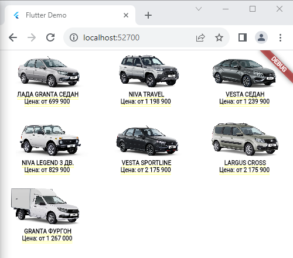
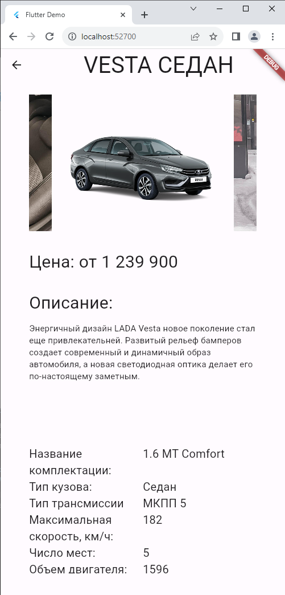
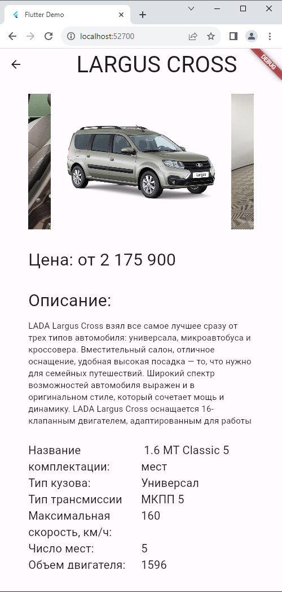
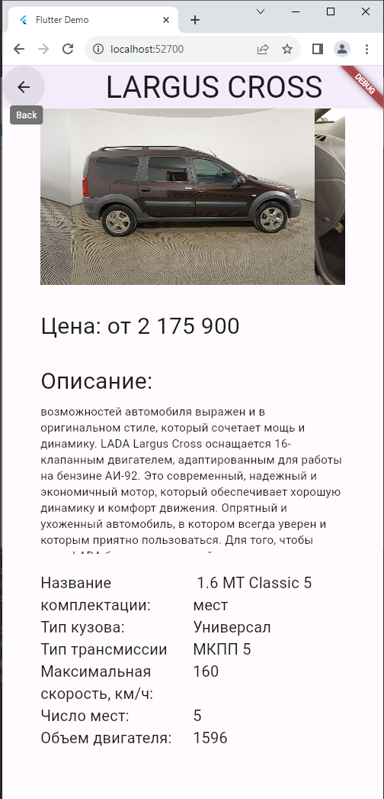

# Авторизация 

# Регистрация

Адапривен при изменении размера экрана

# Каталог

Адапривен при изменении размера экрана

# Карточка товара

# Избранное
Переход в избранное осуществляеться с помощью кнопки с изображением сердечка расположенной в BottomBar

Чтобы удалить товар из избранного нужно повторно нажать на кнопку с сердечком

# Корзина
Переход в корзину осуществляеться с помощью кнопки с изображением корзины расположенной в BottomBar

# Экран "Покупки"
Чтобы товар попал в историю покупок, надо нажать на кнопку "Купить" в каталоге, карточке товара или корзине.
При нажатии "Купить" открываеться диалоговое окно с подтверждением

При нажатии Нет товар в историю покупок добавлен не будет

Иначе товар поподает в историю покупок которую можно посмотреть нажав на кнопку с изображением истории в BottomBar

